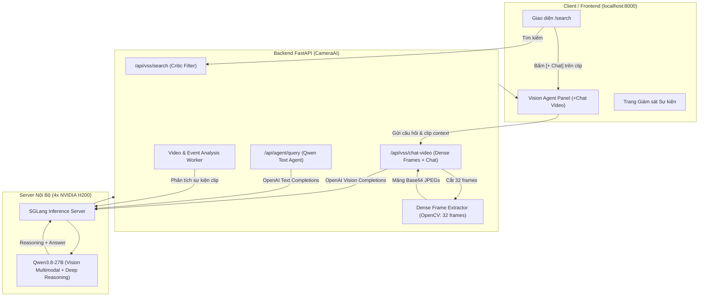

# Kế Hoạch Chuyển Đổi Toàn Diện: Loại Bỏ Cosmos & Gemini 2.5 -> Chuyển 100% Sang Server Nội Bộ 4x NVIDIA H200 (Qwen3.8-27B)

## 1. Bối Cảnh & Quyết Định Chiến Lược

- **Vấn đề trước đây**:
  - **Cosmos (Thị giác local)**: Chạy cục bộ yếu, chỉ cắt được ít frame, hay báo nhầm/ảo giác, đòi hỏi tài nguyên máy client.
  - **Gemini 2.5 (Cloud LLM)**: Phụ thuộc vào Google API Key, thường xuyên dính lỗi giới hạn hạn ngạch Quota 429 (`ResourceExhausted`), độ trễ mạng ra ngoài Internet, rủi ro bảo mật dữ liệu camera nội bộ.
- **Hạ tầng Server Nội Bộ 10+ Tỷ**:
  - Sở hữu **4 cây GPU NVIDIA H200** (~564GB VRAM HBM3e siêu tốc).
  - Inference engine **SGLang** cực nhanh, chạy model **Qwen3.8-27B** (hỗ trợ cả Multimodal Vision và Deep Reasoning).
  - Context window khủng: **262,144 tokens** (thoải mái nhận đồng thời hàng chục frame ảnh 768px-1024px và prompt dài).
- **Quyết định nâng cấp**:
  1. **Khai tử cả Cosmos lẫn Gemini 2.5**: Xóa bỏ hoàn toàn phụ thuộc vào Cosmos local và Gemini API.
  2. **100% Xử Lý Bằng Server Nội Bộ (Qwen3.8-27B)**:
     - **Tác vụ 1 - Dense Frame Video Analysis**: Cắt dày đặc 16 - 32 - 48 frames từ clip video, gửi trực tiếp lên server H200.
     - **Tác vụ 2 - Vision Agent Chat & Query**: Toàn bộ đối thoại, trả lời câu hỏi nghiệp vụ, tra cứu CSDL đều dùng Qwen3.8-27B.
     - **Tác vụ 3 - Báo cáo sự kiện & Cross-checking**: Qwen3.8-27B đối chiếu thị giác + âm thanh + metadata để ra kết luận an ninh.
  3. **Tích hợp nút `+ Chat` tại `localhost:8000/search`**:
     - Khi bấm `+ Chat` trên video tìm kiếm được, giao diện gắn video context, cắt dense frames và gửi prompt lên Server 4x H200, phản hồi trực quan kèm các bước suy luận (Reasoning step).

---

## 2. Thông Số Endpoint Server Nội Bộ 4x H200

Theo file hướng dẫn `OPENCODE_SETUP_GUIDE (1).md` và thực nghiệm kiểm tra:
- **Provider**: Custom OpenAI-Compatible SGLang
- **Base URL**: `https://llm.ttpmsandbox.us.kg/v1`
- **Chat Endpoint**: `https://llm.ttpmsandbox.us.kg/v1/chat/completions`
- **API Key**: Cấu hình qua biến môi trường `QWEN_API_KEY`
- **Model ID**: `Qwen3.8-27B` (hoặc alias `Qwen3.8-Flash-Next`)
- **Headers bắt buộc**:
  ```http
  User-Agent: Mozilla/5.0 (Windows NT 10.0; Win64; x64) AppleWebKit/537.36 (KHTML, like Gecko) Chrome/120.0.0.0 Safari/537.36
  Authorization: Bearer <YOUR_QWEN_API_KEY>
  Content-Type: application/json
  ```
- **Khả năng**:
  - Hỗ trợ ảnh Base64 nén JPEG độ nét cao.
  - Phản hồi cấu trúc gồm cả `reasoning_content` (suy luận logic) và `content` (câu trả lời chuẩn).

---

## 3. Sơ Đồ Kiến Trúc Hệ Thống Toàn Diện



---

## 4. Kế Hoạch Triển Khai Chi Tiết (Implementation Details)

### 4.1 Cấu hình hệ thống: [CameraAI/config.py](file:///d:/CameraV2/CameraAI/config.py)
- Bổ sung cấu hình AI Server nội bộ:
  ```python
  QWEN_SERVER_URL = os.getenv("QWEN_SERVER_URL", "https://llm.ttpmsandbox.us.kg/v1")
  QWEN_API_KEY = os.getenv("QWEN_API_KEY", "")
  QWEN_MODEL_NAME = os.getenv("QWEN_MODEL_NAME", "Qwen3.8-27B")
  QWEN_USER_AGENT = "Mozilla/5.0 (Windows NT 10.0; Win64; x64) AppleWebKit/537.36 (KHTML, like Gecko) Chrome/120.0.0.0 Safari/537.36"
  DENSE_FRAMES_COUNT = int(os.getenv("DENSE_FRAMES_COUNT", "8"))
  ```
- Đánh dấu deprecated các cấu hình Cosmos và Gemini.

### 4.2 Module AI Server Client Thống Nhất: `CameraAI/qwen_vision_client.py` [NEW]
- **`extract_dense_frames(clip_path: Path, num_frames=32, max_dim=768)`**:
  - Dùng OpenCV đọc video.
  - Lấy 32 frame trải đều từ đầu đến cuối clip.
  - Resize và nén JPEG chất lượng 80 -> Base64 Data URL.
- **`call_qwen_chat(messages, max_tokens=4096, temperature=0.2)`**:
  - Gọi `https://llm.ttpmsandbox.us.kg/v1/chat/completions` với header User-Agent và Auth.
  - Trả về dictionary: `{"content": text, "reasoning": reasoning_text, "model": model}`.
- **`analyze_video_dense(clip_path, prompt, history=None, num_frames=32)`**:
  - Ghép mảng 32 ảnh Base64 và prompt vào messages.
  - Gửi lên Qwen3.8-27B trên Server H200 để phân tích thị giác toàn diện.
- **`generate_event_summary_qwen(event, visual_results, audio_info)`**:
  - Thay thế hoàn toàn cho `gemini_video_report.py`.
  - Qwen3.8-27B đóng vai trò chuyên gia an ninh tổng hợp chéo, đánh giá nguy cơ (`none`, `low`, `medium`, `high`) và khuyến nghị hành động.

### 4.3 Cập nhật Backend: [CameraAI/main.py](file:///d:/CameraV2/CameraAI/main.py)
- **Endpoint mới `POST /api/vss/chat-video`**:
  - Nhận `video_url` hoặc `clip_filename` hoặc `event_id` cùng `query` của người dùng.
  - Gọi `analyze_video_dense` cắt 32 frames và phân tích.
  - Trả về `reply`, `reasoning`, `frame_count`, `video_title`.
- **Thay thế `/api/agent/query`**:
  - Bỏ đoạn code gọi `generativelanguage.googleapis.com` của Gemini và bỏ biến `_gemini_quota_exceeded_until`.
  - Chuyển sang gọi `call_qwen_chat()` của server H200 nội bộ.
- **Cập nhật `video_analysis_worker.py`**:
  - Bỏ kiểm tra health Cosmos (`COSMOS_VIDEO_URL`).
  - Dùng trực tiếp `qwen_vision_client` để phân tích clip sự kiện nhanh chóng và chính xác.

### 4.4 Cập nhật Search Engine: [CameraAI/vss_search_engine.py](file:///d:/CameraV2/CameraAI/vss_search_engine.py)
- Đưa thêm `clip_filename` và `event_id` vào mỗi phần tử kết quả `results.append(...)`.
- Cập nhật thông tin mô hình hiển thị là `Qwen3.8-27B (4x H200)`.

### 4.5 Nâng cấp giao diện `localhost:8000/search`: [CameraAI/templates/search.html](file:///d:/CameraV2/CameraAI/templates/search.html)
- **Nút `+ Chat` trên thẻ Video**:
  - Khi click `+ Chat`, lưu thông tin clip vào state `activeChatVideo`.
  - Mở sidebar Vision Agent bên phải.
  - Hiển thị badge đính kèm video clip phía trên ô chat input:
    `🎬 warehouse_sample (32 frames) [✕]`.
  - Tự động điền câu hỏi gợi ý và focus vào ô input.
- **Gửi tin nhắn**:
  - Nếu có `activeChatVideo`, chuyển hướng gửi tới `/api/vss/chat-video`.
  - Hiển thị phản hồi với huy hiệu `Qwen3.8-27B · 4x H200 SGLang`.
  - Cho phép người dùng bấm xem quá trình suy luận (Reasoning collapsible block).
  - Hỗ trợ trò chuyện tương tác tiếp tục (follow-up Q&A) cho chính clip đó.

---

## 5. Kế Hoạch Xác Minh (Verification Plan)

### 5.1 Test Tự Động Với Server Nội Bộ
1. **Kiểm tra trích xuất frame**:
   - Trích xuất 32 frames từ `clips/warehouse_sample.mp4`, xác nhận độ phân giải và dung lượng tối ưu.
2. **Kiểm tra Multimodal Vision trên Qwen3.8-27B**:
   - Gửi 32 frames qua script Python lên server H200, kiểm tra thời gian phản hồi (dưới 4 giây) và chất lượng phân tích.
3. **Kiểm tra Text Reasoning Agent**:
   - Gọi `/api/agent/query`, xác nhận phản hồi từ Qwen3.8-27B không dính lỗi Gemini 429.

### 5.2 Test Thủ Công Giao Diện Web
1. Truy cập `http://localhost:8000/search`.
2. Tìm kiếm *"người vận chuyển thùng hàng"*.
3. Bấm nút **`+ Chat`** trên một video clip kết quả:
   - Sidebar Vision Agent mở ra, hiển thị badge video đang chọn.
   - Nhấn Enter gửi câu hỏi.
   - Kiểm tra kết quả phản hồi chi tiết, có phân tích hành động theo giây, và có phần Reasoning của Qwen3.8-27B.
4. Chat tiếp câu hỏi thứ 2 để kiểm chứng tính liên tục của ngữ cảnh video.
